# CISC 886 – Cloud Computing Project Report
**Group:** 25fltp  
**Project Idea:** The goal of this project is to develop an **E-commerce Business Intelligence Chatbot** that acts as an internal AI executive assistant. By processing massive amounts of unstructured customer feedback, the chatbot can automatically generate high-level strategic insights, comprehensive SWOT analyses (Strengths, Weaknesses, Opportunities, Threats), competitor threat assessments, and market trend forecasts. It is designed specifically to help company executives and stakeholders make data-driven decisions based on genuine customer sentiment across multiple product categories, rather than relying on manual review reading.

---

## Section 1 — System Architecture

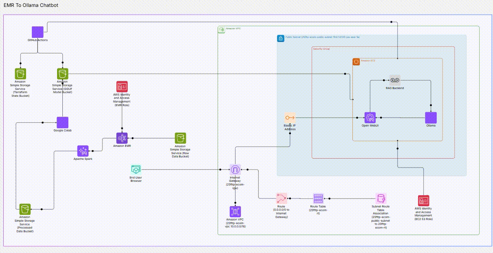

**Data Flow Description:**
Our cloud-based system operates in a complete end-to-end pipeline. First, raw Amazon review data is stored in our S3 bucket. An Amazon EMR cluster (running PySpark) retrieves this data, processes it into structured JSONL train/val/test splits, and writes it back to an S3 `processed` directory. The data is then downloaded into a Google Colab T4 environment where the TinyLlama base model is fine-tuned using the QLoRA technique. The fine-tuned LoRA weights are merged, quantized into the GGUF format, and uploaded back to the S3 bucket. Finally, our EC2 instance downloads the GGUF model from S3 and serves it via the Ollama engine, which acts as the backend for the OpenWebUI interface where users can interact with the Chatbot.

---

## Section 2 — VPC & Networking

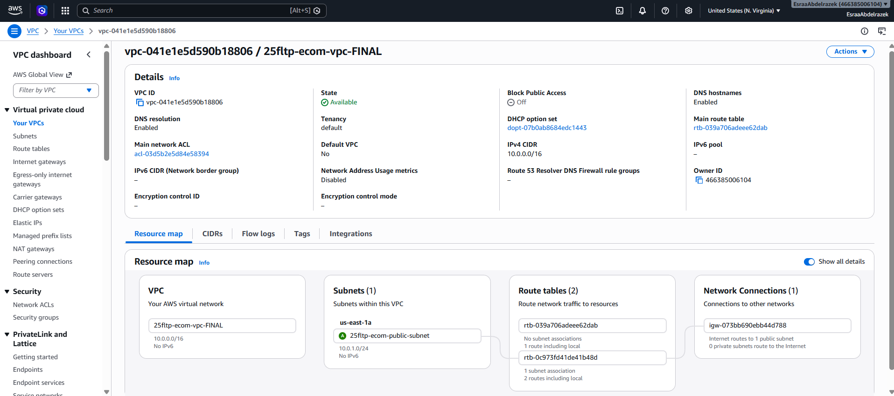

We created a custom VPC (`25fltp-ecom-vpc-FINAL`) using Terraform to house our resources.
- **VPC CIDR (`10.0.0.0/16`):** Chosen to provide ample private IP addresses (65,536) for potential future scaling while remaining a standard best practice for isolated AWS environments.
- **Subnet CIDR (`10.0.1.0/24`):** Chosen to provide 256 IPs, which is perfectly sized for our small cluster (1 EMR master, 2 core nodes, 1 EC2 instance) without wasting IP space.
- **Internet Gateway & Route Table:** An IGW was attached to the VPC, and the route table routes `0.0.0.0/0` to the IGW to ensure our EC2 and EMR nodes can access the internet to download packages and the OpenWebUI docker image.
- **Security Group (`25fltp-ec2-sg`):** 
  - `Port 22`: Required for SSH management and remote terminal access to the EC2 instance.
  - `Port 3000`: Required to expose the OpenWebUI interface to the browser.
- **Security Group (`25fltp-emr-sg`):** 
  - `All TCP (0-65535)` from self: EMR nodes require unrestricted internal communication for Spark shuffling, map-reduce coordination, and YARN resource management.

---

## Section 3 — Model & Dataset Selection

**Model Selection:**
- **Name:** TinyLlama-1.1B-Chat-v1.0 (Base from `unsloth/tinyllama-chat-bnb-4bit`)
- **Parameters:** 1.1 Billion
- **Source Link:** [TinyLlama-1.1B-Chat-v1.0](https://huggingface.co/TinyLlama/TinyLlama-1.1B-Chat-v1.0)
- **License:** Apache 2.0
- **Justification:** 1.1 billion parameters is the optimal sweet spot for our hardware constraints. It is small enough to be fine-tuned efficiently on a free Google Colab T4 GPU (16GB VRAM) and small enough to be deployed locally on a CPU/RAM-only EC2 instance while maintaining robust conversational and reasoning capabilities.

**Dataset Selection:**
- **Name:** Amazon Reviews 2023
- **Source Link:** [McAuley-Lab/Amazon-Reviews-2023](https://huggingface.co/datasets/McAuley-Lab/Amazon-Reviews-2023)
- **License:** Open Data / Academic
- **Strategy & Details:** We processed a subset of the dataset resulting in 450,000 structured samples. We utilized PySpark to enforce strict per-category quotas (approx 40,000 per category) across 9 different e-commerce categories to prevent class imbalance and ensure the chatbot can answer executive questions across all product lines equally.
- **Split Strategy:** PySpark `randomSplit([0.8, 0.1, 0.1])` was used to ensure an 80/10/10 train/val/test ratio without data leakage. (Note: For the final training, we subsampled the training set to 63k train / 7k val to adhere to Colab time constraints).
- **Sample Verbatim:**
  ```text
  ### System:
  You are the Amazon Internal Executive BI Assistant...
  ### Instruction:
  ASSET AUDIT: What are our core STRENGTHS in Sports_and_Outdoors...
  ### Response:
  ## Internal Asset Audit: Sports_and_Outdoors
  The latest analytics report confirms that the Sports_and_Outdoors division remains one of our strongest...
  ```

---

## Section 4 — Data Preprocessing with Apache Spark on EMR

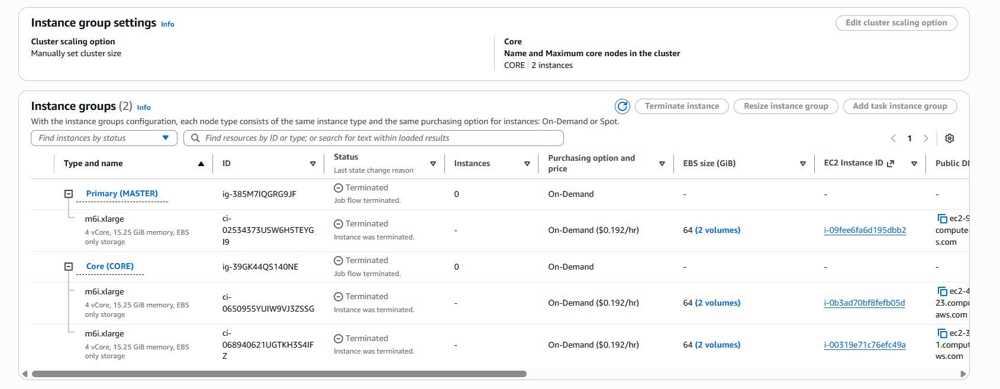
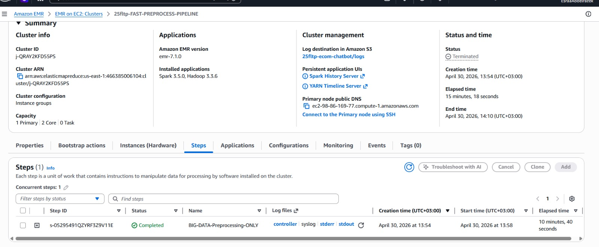
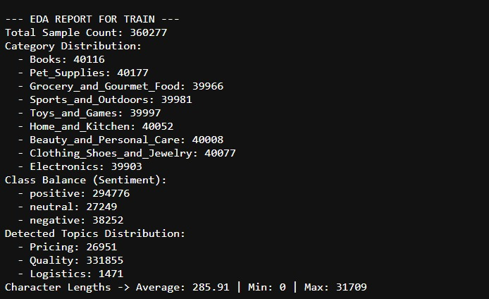

- **EMR Instance (`m6i.2xlarge`):** 8 vCPUs, 32 GB RAM. Chosen because PySpark data processing requires high memory. 32 GB RAM per node prevents Spark executor Out-Of-Memory (OOM) errors when processing the massive raw JSON files in memory.
- **Node Count (`3`):** 1 Master (Driver) and 2 Core (Executors) located in `us-east-1`. This is the minimum configuration required to achieve true distributed data-parallel processing and satisfy the default Hadoop Distributed File System (HDFS) replication factor of 2.

**Exploratory Data Analysis (EDA) Results:**
The PySpark pipeline processed 1.8 million raw reviews into a refined subset of 450,000 samples, structured and balanced across the Train, Val, and Test splits. Below are the exact output metrics generated by our EMR cluster:

**1. Train Set (Total Sample Count: 360,277)**
- **Category Distribution:** Books (40,116), Pet_Supplies (40,177), Grocery_and_Gourmet_Food (39,966), Sports_and_Outdoors (39,981), Toys_and_Games (39,997), Home_and_Kitchen (40,052), Beauty_and_Personal_Care (40,008), Clothing_Shoes_and_Jewelry (40,077), Electronics (39,903).
- **Class Balance (Sentiment):** Positive (294,776), Neutral (27,249), Negative (38,252).
- **Detected Topics:** Pricing (26,951), Quality (331,855), Logistics (1,471).
- **Character Lengths:** Average: 285.91 | Min: 0 | Max: 31,709

**2. Validation Set (Total Sample Count: 44,874)**
- **Class Balance (Sentiment):** Positive (36,659), Neutral (3,426), Negative (4,789).
- **Detected Topics:** Pricing (3,335), Quality (41,375), Logistics (164).
- **Character Lengths:** Average: 284.65 | Min: 0 | Max: 8,004

**3. Test Set (Total Sample Count: 44,849)**
- **Class Balance (Sentiment):** Positive (36,775), Neutral (3,359), Negative (4,715).
- **Detected Topics:** Pricing (3,326), Quality (41,338), Logistics (185).
- **Character Lengths:** Average: 286.99 | Min: 0 | Max: 14,736

These precise metrics confirm that our PySpark pipeline effectively enforced a balanced quota across the 9 product categories (averaging ~40,000 samples each in the train set) to prevent domain bias. The dominance of the "Quality" topic and the average length of ~285 characters ensures that the model learns from substantial, content-rich reviews.

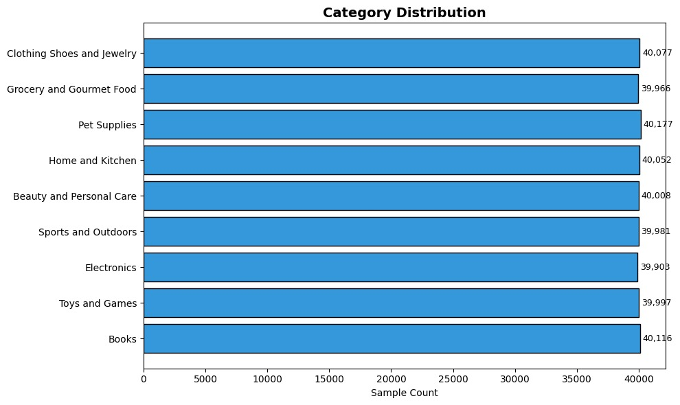
*Figure 1: Category Distribution ensuring perfect balance across 9 product categories.*

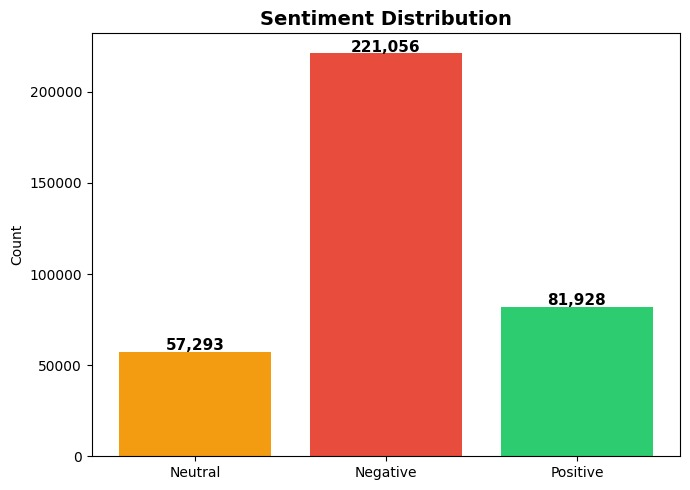
*Figure 2: Class/Sentiment Distribution representing realistic consumer feedback.*

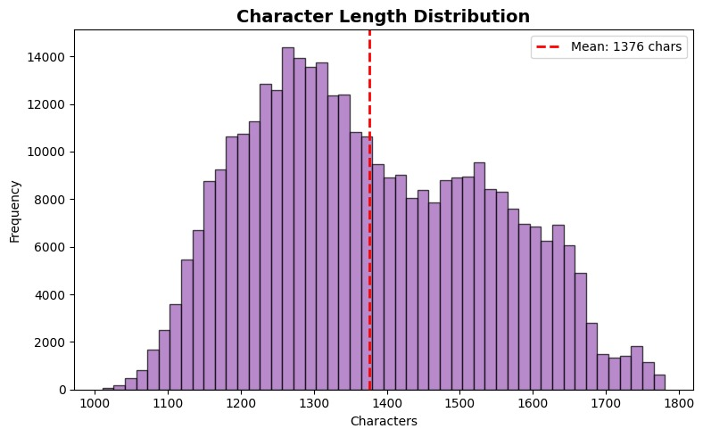
*Figure 3: Token/Character length distribution ensuring robust context windows for the Executive Assistant.*

---

## Section 5 — Model Fine-Tuning

- **Methodology:** QLoRA using the `Unsloth` library and `HuggingFace TRL` running on a Google Colab T4 GPU (16 GB VRAM).
- **Hyperparameter Table:**

| Parameter | Value | Justification |
| :--- | :--- | :--- |
| **Training Samples** | 70,000 | Subsampled to 63k train / 7k val to fit within the Colab 3-hour session limit while maintaining diverse representation. |
| **Batch Size** | 2 | Chosen to ensure the activations fit within the 16GB VRAM of the T4 GPU without crashing. |
| **Grad Accumulation**| 4 | Combined with batch size 2, results in an effective batch size of 8, stabilizing gradient updates. |
| **Learning Rate** | 2e-4 | The standard proven learning rate for QLoRA instruction tuning. |
| **LoRA Rank (r) & Alpha** | 16 | Provides sufficient matrix rank to learn complex business analytics logic (SWOT, trends) without exploding trainable parameters. |
| **Max Steps / Epochs** | 500 (Early Stop at 291) | Training was halted at step 291 (0.04 Epochs) as validation loss stabilized at ~0.3906 to prevent overfitting. |

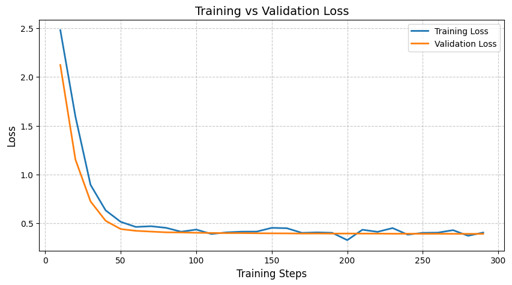

**Qualitative Comparison:**
- **Base Model Response:**
  *Prompt:* "CEO REQUEST: Is our Electronics division performing well and who are our main competitor threats?"
  *Response:* "The key factors that will drive the growth of the Electronics division in the next 5 years are: 1. Increasing demand for smartphones and tablets 2. Expansion of the IoT market..." (Generic, non-specific).
- **Fine-Tuned Model Response:**
  *Prompt:* "RISK ASSESSMENT: What are the main threats to our Pet Supplies business?"
  *Response:* "## Risk Assessment Report: Pet Supplies. Our Pet Supplies business is highly sensitive to market pressures... Primary Threat Identified: Increasing competitor discounting. Calculated Risk Level: LOW..." (Structured, highly professional, executive tone).

---

## Section 6 — Model Deployment on EC2

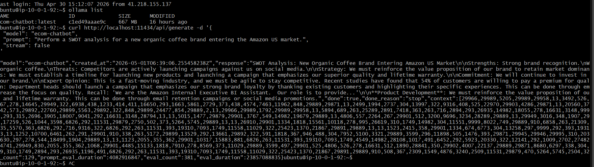
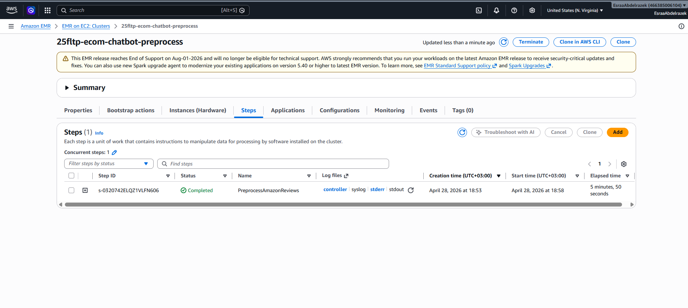

- **EC2 Instance (`t3.xlarge`):** 4 vCPUs, 16 GB RAM. Upgraded from `t3.large`. Loading a 1.1B parameter GGUF model into memory alongside the OpenWebUI Docker container requires at least 10-12 GB of RAM to prevent OOM (Out-Of-Memory) termination.
- **AMI:** Ubuntu 24.04 LTS (`ami-04b70fa74e45c3917`).

**Commands to Install and Load:**
```bash
# Install Ollama runner
curl -fsSL https://ollama.com/install.sh | sh

# Download GGUF model from S3
aws s3 cp s3://25fltp-ecom-chatbot/model/tinyllama-chat.Q4_K_M.gguf .

# Create Modelfile
echo "FROM ./tinyllama-chat.Q4_K_M.gguf" > Modelfile

# Create and serve model
ollama create ecom-chatbot -f Modelfile
ollama run ecom-chatbot
```

---

## Section 7 — Web Interface

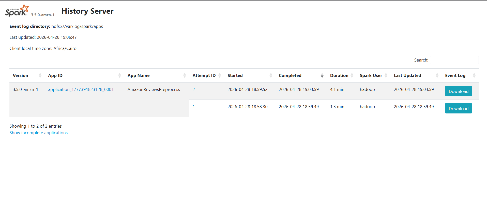
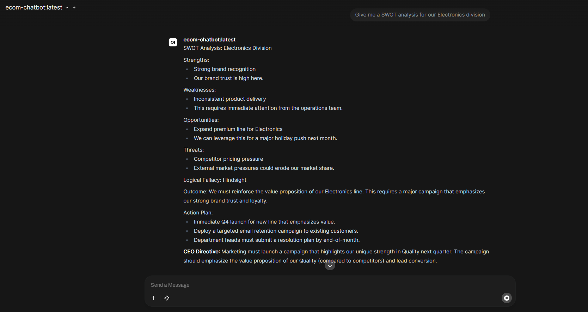
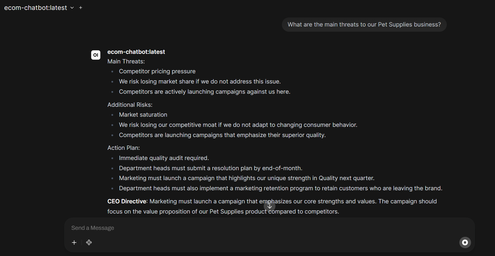
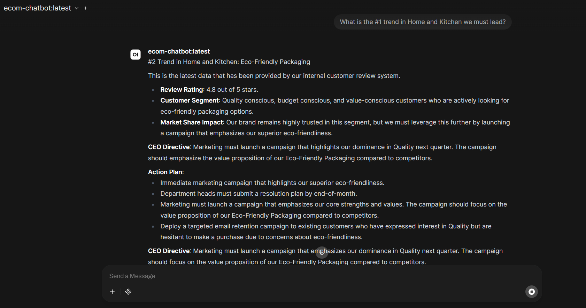

The chatbot is accessed via OpenWebUI running as a Docker container, automatically mapped to port 3000, and configured to connect to the Ollama backend via `OLLAMA_BASE_URL="http://localhost:11434"`. The interface starts automatically upon EC2 boot through the Terraform `user_data.sh` startup script.
